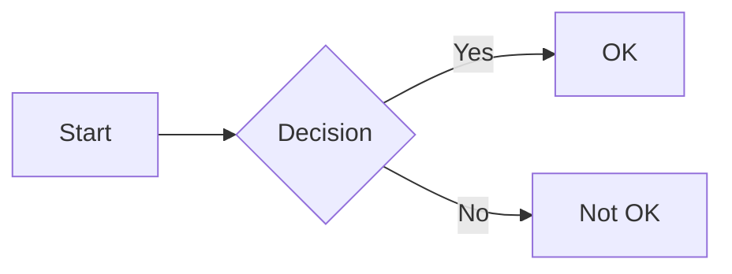
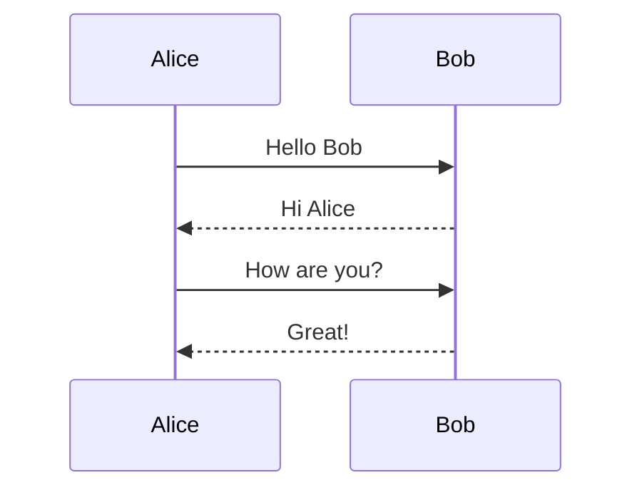
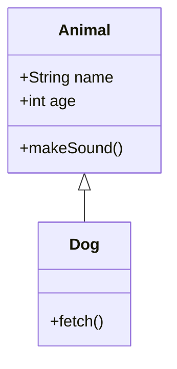
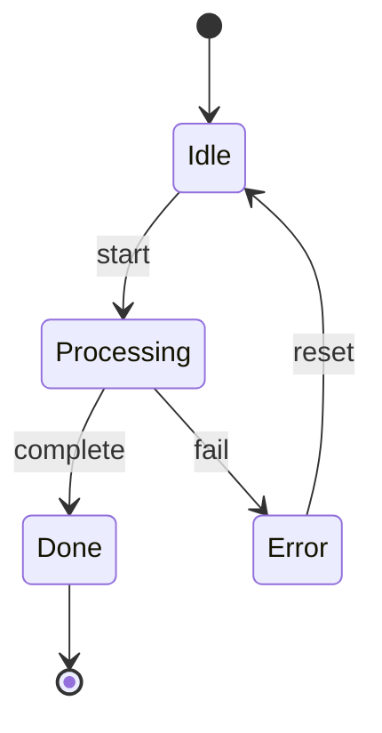
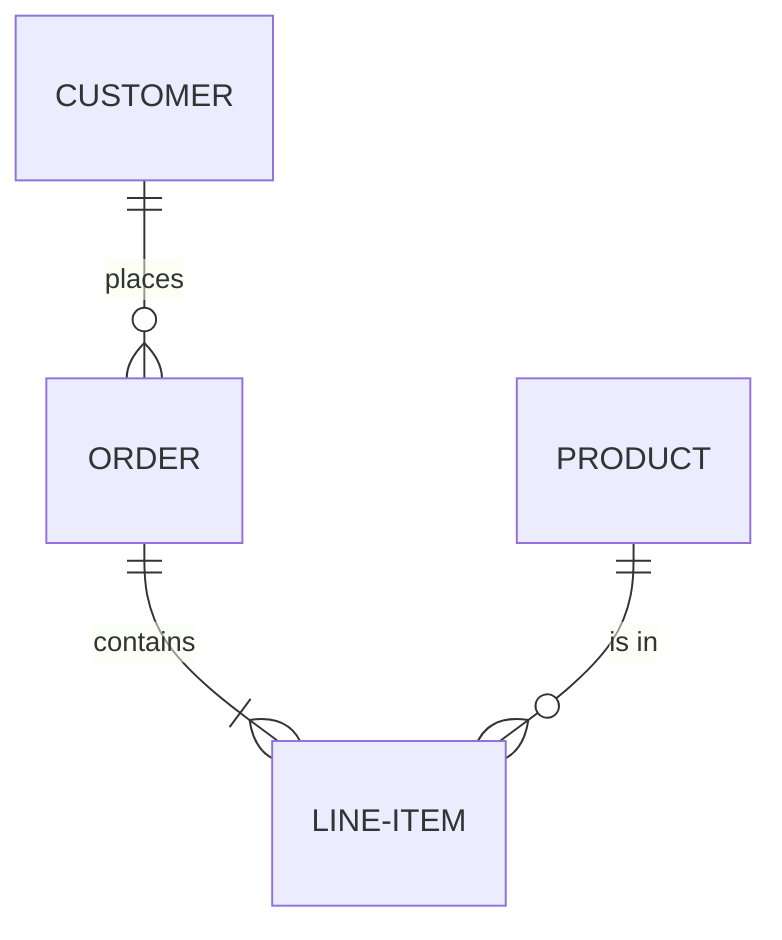
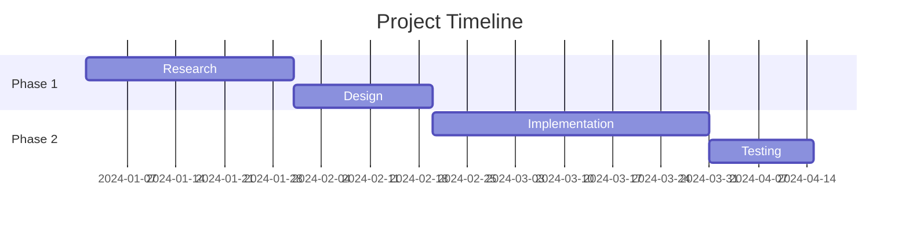
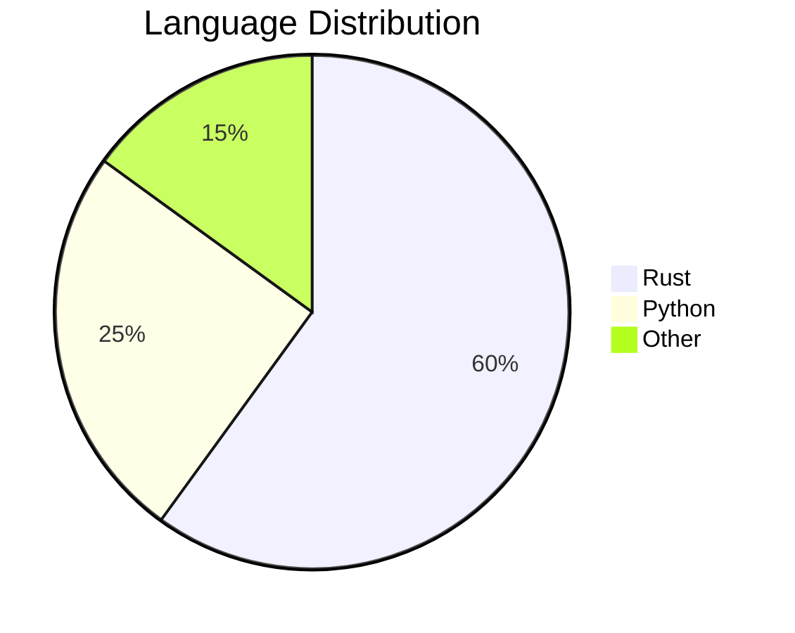
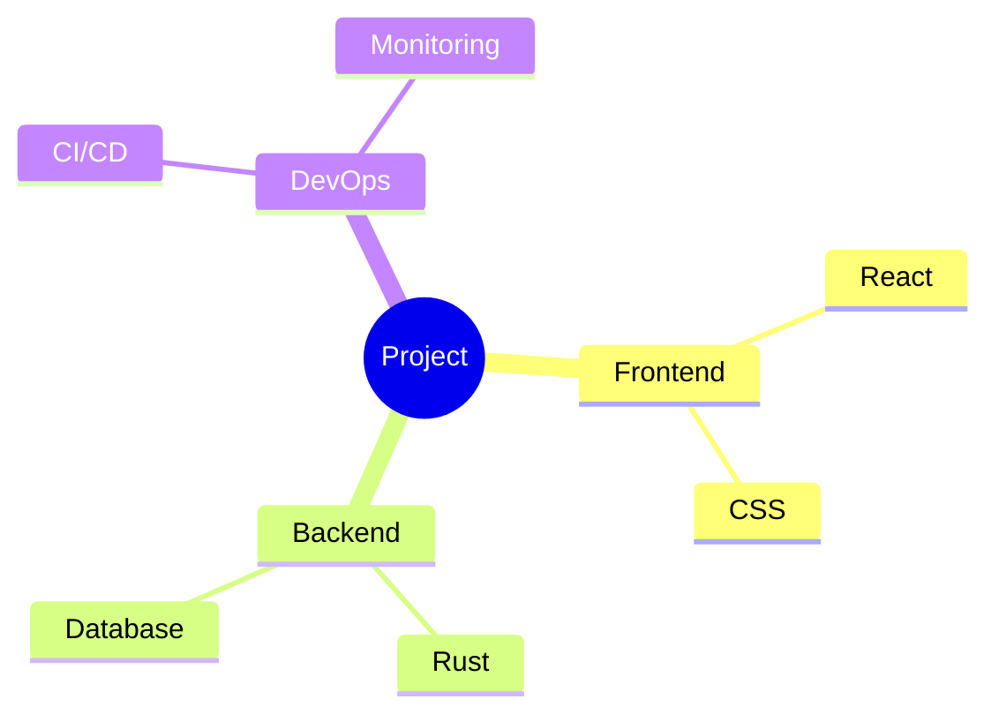
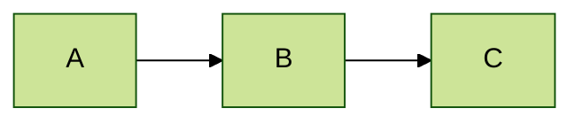

# Diagram Types

mdbook-mermaid-mmdr supports all diagram types provided by `mermaid-rs-renderer`. Below are examples of the most commonly used types. Each section shows the Markdown source followed by the live rendered result.

## Flowchart

````markdown

````


## Sequence Diagram

````markdown

````


## Class Diagram

````markdown

````


## State Diagram

````markdown

````


## Entity Relationship Diagram

````markdown

````


## Gantt Chart

````markdown

````


## Pie Chart

````markdown

````


## Mindmap

````markdown

````


## Inline Theme Directives

You can override the theme on a per-diagram basis using Mermaid's `%%{init: ...}%%` directive:

````markdown

````


For the full list of supported diagram types, see the [mermaid-rs-renderer documentation](https://github.com/1jehuang/mermaid-rs-renderer).
