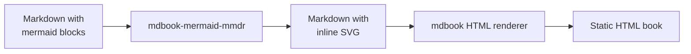

# Introduction

**mdbook-mermaid-mmdr** is an [mdbook](https://rust-lang.github.io/mdBook/) preprocessor that renders [Mermaid](https://mermaid.js.org/) diagrams to SVG at build time.

Unlike client-side approaches that rely on the Mermaid JavaScript library, or tools that shell out to Node.js / Puppeteer, this preprocessor uses [mermaid-rs-renderer](https://github.com/1jehuang/mermaid-rs-renderer) — a pure Rust Mermaid renderer. The result is static SVG embedded directly in your book's HTML.

## Key Features

- **Server-Side Rendering** — Diagrams are rendered during `mdbook build`, not in the reader's browser.
- **Zero Client-Side JavaScript** — No heavy JS bundles or runtime rendering overhead.
- **Pure Rust** — No Node.js, npm, or Puppeteer dependency. Just `cargo install`.
- **Configurable Themes** — Choose between built-in themes or override individual theme variables.
- **Robust Error Handling** — Invalid diagrams produce inline error messages instead of failing the build.

## How It Works

1. mdbook invokes the preprocessor before the HTML renderer.
2. The preprocessor scans each chapter's Markdown for fenced code blocks tagged `mermaid`.
3. Each mermaid block is rendered to SVG via `mermaid-rs-renderer`.
4. The SVG replaces the original code block, wrapped in `
`.
5. mdbook continues with the modified Markdown as usual.

Because the SVG is inlined at build time, the resulting book works without any JavaScript and renders correctly even in environments where scripts are blocked.

## Live Example

This very book uses mdbook-mermaid-mmdr to render its diagrams. Here is the preprocessor pipeline visualized:

