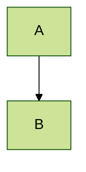

# Theme Customization

There are three levels of theme control, from broadest to most specific.

## 1. Base Theme in `book.toml`

Set the `theme` field to choose the overall color scheme:

```toml
[preprocessor.mermaid-mmdr]
theme = "modern"
```

See the [Configuration](configuration.md) chapter for the full list of accepted values.

## 2. Theme Variable Overrides

Override individual theme properties while keeping the rest of the base theme:

```toml
[preprocessor.mermaid-mmdr]
theme = "modern"

[preprocessor.mermaid-mmdr.theme_variables]
primary_color = "#ffcccc"
line_color = "#ff0000"
secondary_color = "#ccffcc"
```

The override is applied by serializing the resolved theme to JSON, merging in your key-value pairs, and deserializing back. This means any field on the `Theme` struct is a valid key.

## 3. Per-Diagram Inline Directives

For one-off customization, use Mermaid's native `%%{init: ...}%%` directive at the top of a diagram:

````markdown

````

This applies only to the single diagram and takes precedence over `book.toml` settings.

## Background Color

The background color is independent of the theme and can be set separately:

```toml
[preprocessor.mermaid-mmdr]
background = "#ffffff"
```

Set it to `"transparent"` if you want the diagram to inherit the page background.

## CSS Styling

Every rendered diagram is wrapped in a `<div class="mermaid-mmdr-svg">` element. You can target this class in a custom mdbook theme to add margins, borders, or other styling:

```css
.mermaid-mmdr-svg {
    text-align: center;
    margin: 1em 0;
}

.mermaid-mmdr-svg svg {
    max-width: 100%;
    height: auto;
}
```
