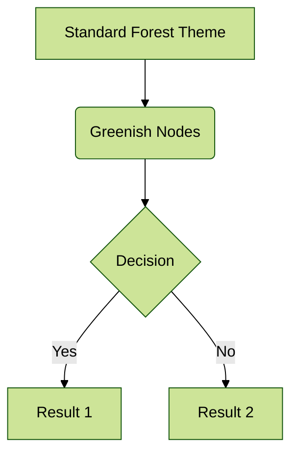
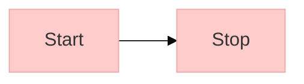
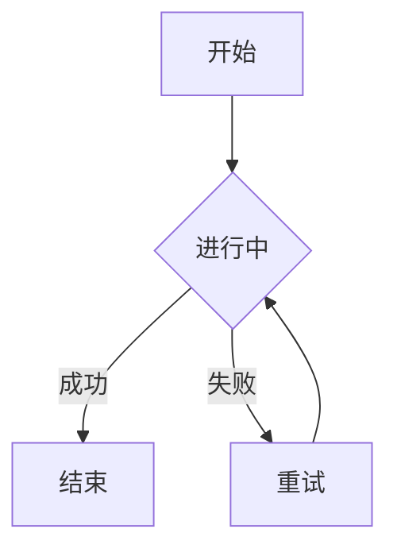

# Customization and Error Handling

Demonstrating theme customization, Unicode support, and error handling.

## Theme Configuration

Configure the Mermaid theme using the `%%{init: {'theme': 'forest'}}%%` directive.



## Custom Theme Variables

Override specific theme variables for fine-grained control.



## Unicode Support

`mdbook-mermaid-mmdr` supports Unicode characters, including Chinese text.



## Error Handling

If a syntax error occurs, `mdbook-mermaid-mmdr` renders an error message with source code.

```mermaid
graph TD
    A --> B
    B -- Syntax Error! --- C
    C -->
```
