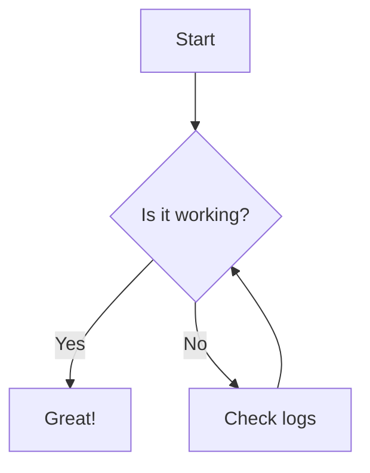
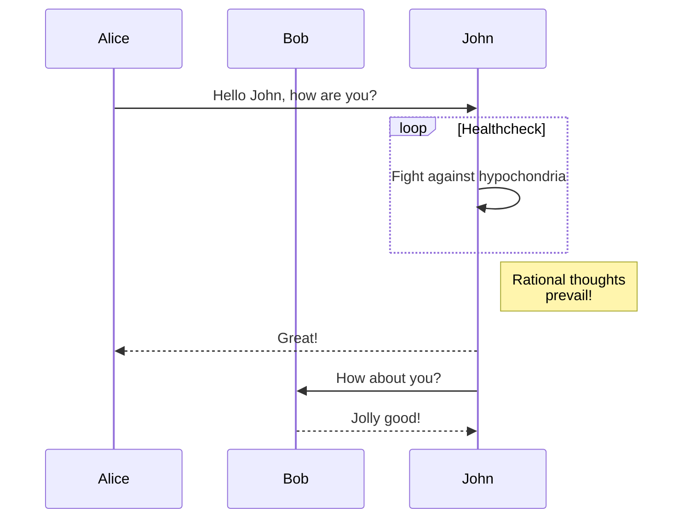
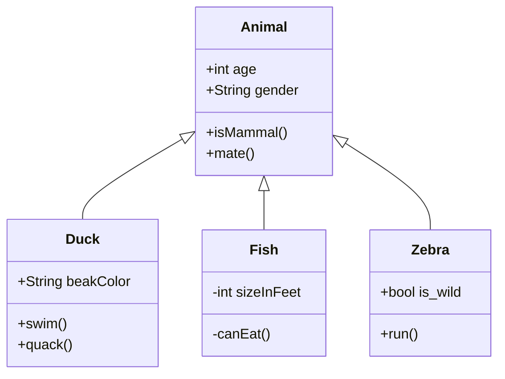

# Introduction

This example showcases various Mermaid diagrams rendered using `mdbook-mermaid-mmdr`.

## Flowchart

```mermaid
graph TD
    A[Start] --> B{Is it working?}
    B -- Yes --> C[Great!]
    B -- No --> D[Check logs]
    D --> B
```

## Sequence Diagram

```mermaid
sequenceDiagram
    participant Alice
    participant Bob
    Alice->>John: Hello John, how are you?
    loop Healthcheck
        John->>John: Fight against hypochondria
    end
    Note right of John: Rational thoughts <br/>prevail!
    John-->>Alice: Great!
    John->>Bob: How about you?
    Bob-->>John: Jolly good!
```

## Class Diagram

```mermaid
classDiagram
    Animal <|-- Duck
    Animal <|-- Fish
    Animal <|-- Zebra
    Animal : +int age
    Animal : +String gender
    Animal: +isMammal()
    Animal: +mate()
    class Duck{
        +String beakColor
        +swim()
        +quack()
    }
    class Fish{
        -int sizeInFeet
        -canEat()
    }
    class Zebra{
        +bool is_wild
        +run()
    }
```
