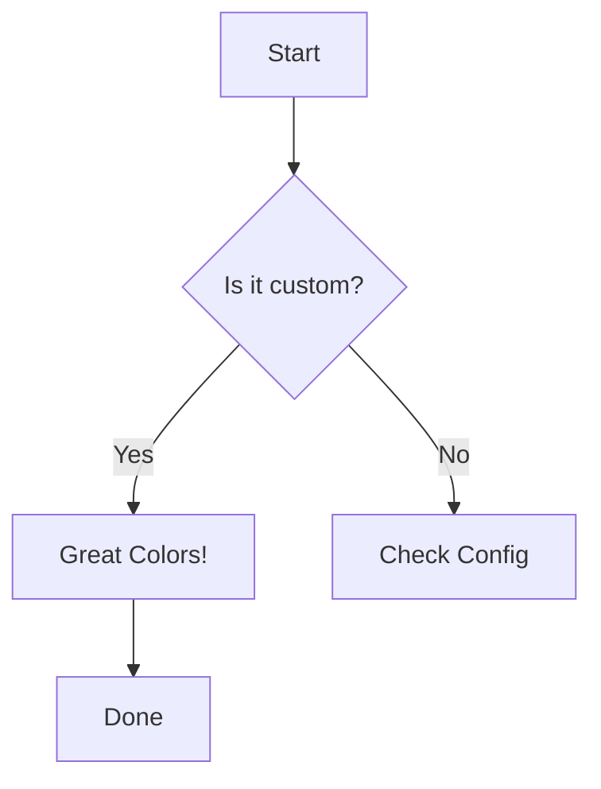

# Custom Theme Variables

This example demonstrates how to use `theme_variables` in `book.toml` to customize Mermaid diagrams beyond the standard themes.

The configuration in `book.toml` looks like this:

```toml
[preprocessor.mermaid-mmdr]
command = "../../target/debug/mdbook-mermaid-mmdr"
theme = "base"
theme_variables = { primary_color = "#ffcccc", line_color = "#ff0000", secondary_color = "#ccffcc" }
```

The diagram below uses these custom colors automatically.



Note: You can also override specific diagram properties if the renderer supports them.
